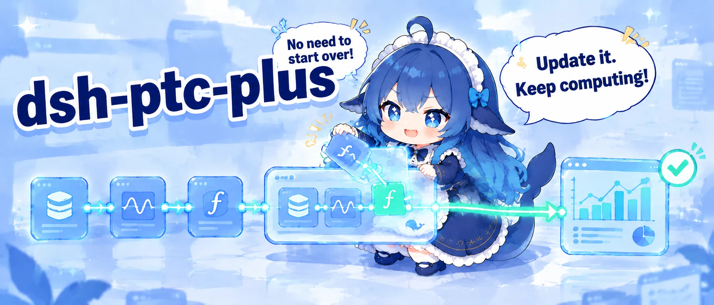
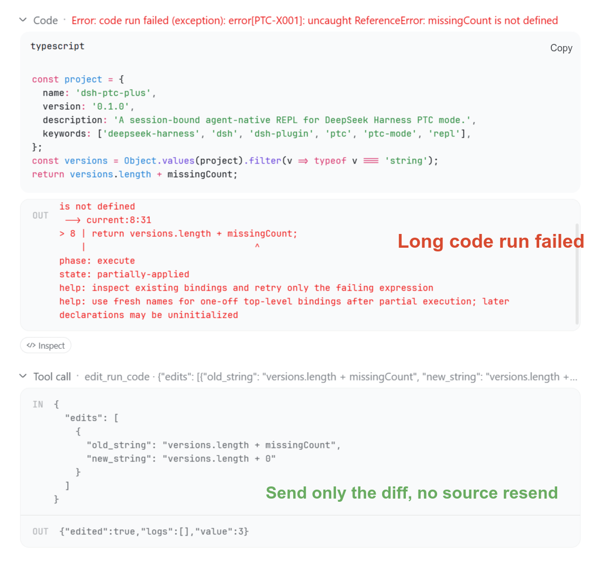
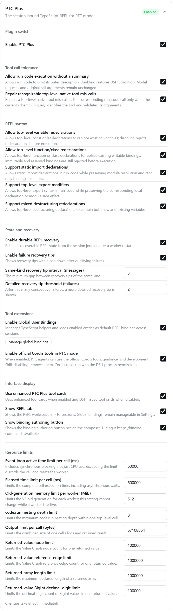
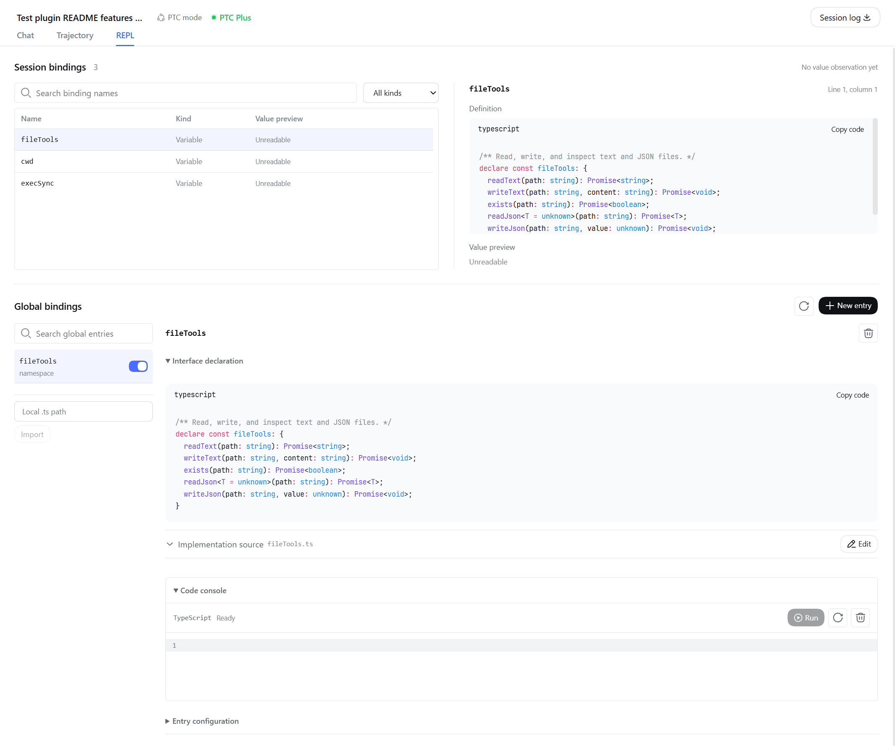
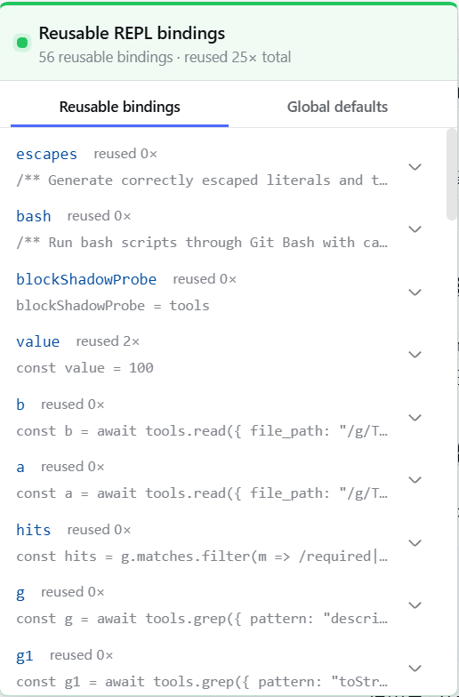

<p align="center">
  
</p>

<p align="center">
  <a href="README.md">简体中文</a> ·
  <strong>English</strong>
</p>

<p align="center">
  <a href="#what-default-ptc-mode-gets-wrong">Problems</a> ·
  <a href="#three-scenes-that-matter-most">Scenes</a> ·
  <a href="#settings">Settings</a> ·
  <a href="#scope">Scope</a> ·
  <a href="#install">Install</a> ·
  <a href="#documentation">Docs</a>
</p>

<p align="center">
  <a href="https://github.com/deepseek-ai/deepseek-harness"></a>
  <a href="package.json">=24.0.0" src="https://img.shields.io/badge/Node.js-%5E22.19.0%20%7C%7C%20%3E%3D24.0.0-5fa04e?logo=nodedotjs&logoColor=white"></a>
  <a href="https://www.npmjs.com/package/dsh-ptc-plus"></a>
  <a href="LICENSE"></a>
</p>

<p align="center">
  <a href="https://awesome-dsh-plugin.com/"></a>
</p>

---

**PTC Plus gives DSH PTC mode a persistent TypeScript REPL.** Variables, imports, and computed results from one `run_code` remain available to the next.

> [!NOTE]
> Community plugin, with no affiliation with or endorsement from DeepSeek or DSH.

> [!IMPORTANT]
> Built for `danger-full-access`: code can access Node.js and the operating system directly. The plugin adds no sandbox. Use it where that permission scope is acceptable.

## Install

Requires Node.js `^22.19.0 || >=24.0.0` and official DSH with TypeScript PTC mode. Install into your profile, restart DSH, and select PTC mode:

```sh
dsh plugin --profile <profile> add dsh-ptc-plus
```

No DSH modifications or custom build are required. See the [installation guide](docs/installation.md) for other installation methods, upgrades, and troubleshooting.

## What default PTC mode gets wrong

Default PTC mode starts each execution in a fresh environment, so the model must resend setup code. PTC Plus keeps the session's computation state available for subsequent calls.

| Scenario | Default PTC mode | With PTC Plus |
| --- | --- | --- |
| Continue a calculation | Each call starts fresh and needs the setup code again | Reuse existing variables, functions, imports, and results directly |
| Fix one mistake | Resend the complete corrected code | Send only the changes with `edit_run_code`, then execute the complete corrected cell |
| Use module syntax | Static `import` and `export` are invalid inside the function body | Write them directly in cells; the plugin adapts them |
| Pass special values | JSON cannot fully represent `undefined`, BigInt, cycles, and similar values | Preserve supported special values and reference relationships for further computation and recovery |
| Find an available tool | Look through the tool interfaces supplied to the model | List and search tools from code, then inspect their parameters as needed |
| Omit a call summary | Missing `run_code.description` fails validation | Supply a display summary automatically so valid code can proceed |
| Recover a top-level tool miscall | Undeclared top-level calls are rejected in PTC mode | Convert a miscall to `run_code` when current tool definitions uniquely identify its target and validate the arguments |
| Access project files | Relative Node paths depend on the host process directory | Resolve file paths, modules, and the default child-process directory from the recorded session project |
| Locate a code error | Return the native error and stack | Map errors to cell source positions; suggest an edit when a single missing closing delimiter has one verified correction |
| Inspect computation state | No reusable session variables remain after execution | Inspect retained variables, definitions, and bounded value previews in the REPL tab |
| Author and reuse helpers | Save the code yourself and load it again in later calls | Author drafts with `/binding`, review them above the composer, and save; enabled bindings work across sessions and supply their interfaces to the model |
| Try a helper manually | No dedicated code workbench for global bindings | Run unsaved source, test it across successive inputs, and inspect results in a workbench with temporary state separate from the Agent session |
| Continue after a restart | No computation state spans calls for recovery | Restore verifiable state from the session record and report what could not be recovered |

Global bindings must be enabled in settings. See [Settings](#settings) and [Scope](#scope) below for optional behavior and recovery limits.

## Three scenes that matter most

### State carries over

The model first executes:

```ts
import { readFile } from 'node:fs/promises'
const manifest = JSON.parse(await readFile('package.json', 'utf8'))
const deps = Object.keys(manifest.dependencies ?? {})
return deps.length
```

The next call continues directly:

```ts
return deps.map(dep => dep + '@' + manifest.dependencies[dep])
```

`deps` and `manifest` remain in the current session. No repeated setup is needed.

### Fix without resending

The model can submit just the replacement:

```ts
edit_run_code({ edits: [{ old_string: 'deps.length', new_string: 'deps' }] })
```

Editing reruns the entire cell. Code that has written files or called external services still requires a safe retry. Syntax errors identify the location; an unambiguous missing closing delimiter can also receive a correction suggestion.



### Have the Agent author a reusable helper

Enable **Global User Bindings** in settings, then enter:

```text
/binding new Create textTools to trim outer whitespace while preserving interior spaces
/binding edit <id> Add line-by-line trimming
```

The Agent can test and revise the helper incrementally with in-memory REPL examples before submitting a draft. Authoring tests must not modify external files or services. The draft opens above the composer, where you can inspect its source and model prompt, then choose **Save as disabled**, **Save and enable**, or **Discard draft**. Testing and submission do not save a global binding.

The panel can be collapsed or closed; the sparkle button's badge reopens it. A successful save or discard closes the panel automatically. The original request retains its source and outcome in history.

Before the first message, hover over or click the sparkle button to view and toggle global bindings. These choices apply to all sessions. The menu also provides authoring and full management entries.

Enabled binding interfaces are supplied to the model in new sessions and updated at the next permitted request in an existing session. Each binding can include a separate usage prompt or omit its interface. Changing only the prompt preserves the helper's runtime state. See the [global binding guide](docs/user-bindings.en.md) for details.

## Settings

Open **Settings → Plugin configuration → PTC Plus**. The main switch controls the plugin; other settings are grouped by purpose:

- **Tool call tolerance**: accept `run_code` without a summary and repair uniquely identifiable top-level native-tool miscalls.
- **REPL syntax**: control redeclarations, module syntax, and destructuring support.
- **State and recovery**: control restart recovery and contextual error tips.
- **Tool extensions**: enable global bindings or official Cordis tools for advanced use.
- **Interface display**: control enhanced tool cards, the REPL tab, and the binding authoring shortcut.
- **Resource limits**: adjust execution time, memory, and output limits.

Global bindings and Cordis tools default to off. Settings generally apply immediately; a worker's memory limit cannot change while it is active. See the [configuration reference](docs/runtime-reference.md#configuration) for fields, defaults, and limits.



The **REPL** tab lets you search session bindings, inspect definitions, and manage global bindings. The global binding workbench's code console can run unsaved source with independent temporary state. File and network operations performed there still have real effects.



On wide screens, the green **PTC Plus** header indicator offers a quick binding list. On narrow screens, use the **REPL** tab:



## Scope

DSH continues to own tool permissions, approvals, cancellation, and sandbox policy. PTC Plus cannot recover every state across restarts: external inputs, unverifiable history, and context compaction can reduce the recovered state. Recovery neither repeats nor reverses historical external operations.

Value previews have size and type limits; objects that cannot be read reliably appear as unavailable. An enabled binding can also fail initialization, with failures reported in execution results. See the [runtime reference](docs/runtime-reference.md) for details.

Model calls and token usage depend on the task and model. A recorded paired observation and its limitations are in the [evaluation guide](docs/evaluation.md#recorded-paired-observation).

## Documentation

[Global binding guide](docs/user-bindings.en.md) · [Installation and upgrades](docs/installation.md) · [Runtime reference](docs/runtime-reference.md) · [Development and architecture](docs/architecture.md) · [All documentation](docs/README.md)

[MIT License](LICENSE).
