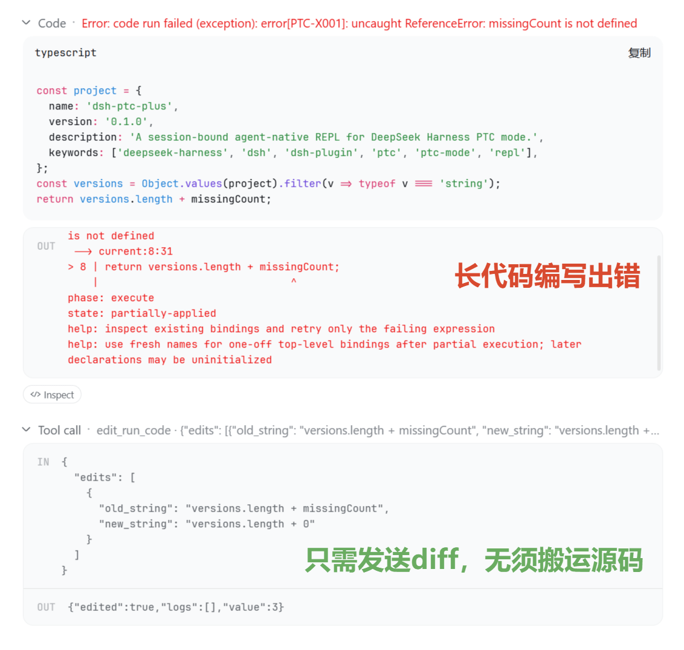
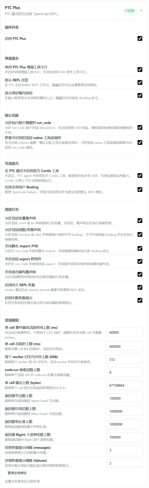
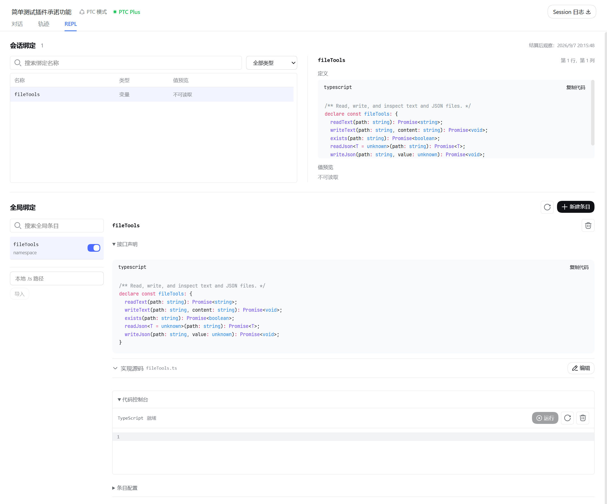
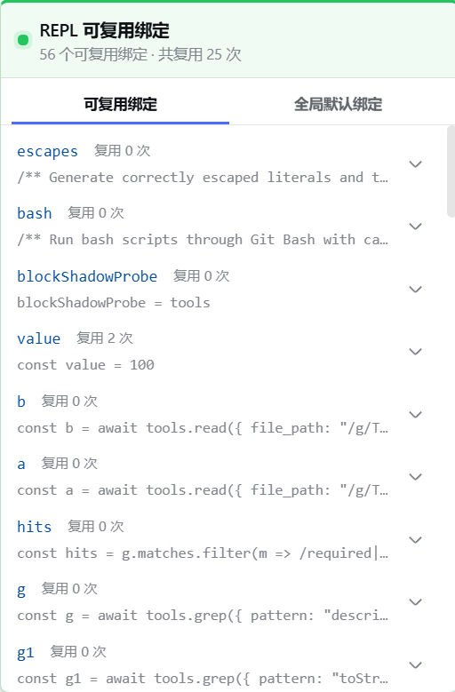

<p align="center">
  
</p>

<p align="center">
  <strong>简体中文</strong> ·
  <a href="README.en.md">English</a>
</p>

<p align="center">
  <a href="#%E9%BB%98%E8%AE%A4-ptc-%E6%A8%A1%E5%BC%8F%E7%9A%84%E9%97%AE%E9%A2%98">问题</a> ·
  <a href="#%E4%B8%89%E4%B8%AA%E6%9C%80%E7%9B%B4%E6%8E%A5%E7%9A%84%E5%9C%BA%E6%99%AF">场景</a> ·
  <a href="#%E8%AE%BE%E7%BD%AE">设置</a> ·
  <a href="#%E8%8C%83%E5%9B%B4">范围</a> ·
  <a href="#%E5%AE%89%E8%A3%85">安装</a> ·
  <a href="#%E6%96%87%E6%A1%A3">文档</a>
</p>

<p align="center">
  <a href="https://github.com/deepseek-ai/deepseek-harness"></a>
  <a href="package.json">=24.0.0" src="https://img.shields.io/badge/Node.js-%5E22.19.0%20%7C%7C%20%3E%3D24.0.0-5fa04e?logo=nodedotjs&logoColor=white"></a>
  <a href="https://www.npmjs.com/package/dsh-ptc-plus"></a>
  <a href="LICENSE"></a>
</p>

<p align="center">
  <a href="https://awesome-dsh-plugin.com/zh/"></a>
</p>

---

**PTC Plus 让 DSH 的 PTC 模式拥有连续的 TypeScript REPL。** 上一次 `run_code` 的变量、导入和计算结果，下一次可以直接复用。默认允许直接同名修订：已有闭包读取更新后的绑定，导入可被局部覆盖再重新导入，失败的声明不会永久占住名称。

> [!NOTE]
> 社区插件，与 DeepSeek 或 DSH 无隶属、无背书。

> [!IMPORTANT]
> 面向 `danger-full-access` 设计：代码可直接访问 Node.js 与操作系统，插件不另加沙箱。仅在可接受此权限的环境使用。

## 安装

需要 Node.js `^22.19.0 || >=24.0.0` 和支持 TypeScript PTC 模式的官方 DSH。安装到你使用的 profile，然后重启 DSH 并选择 PTC 模式：

```sh
dsh plugin --profile <profile> add dsh-ptc-plus
```

无需修改 DSH 或使用定制版本。其他安装方式、升级和故障排查见[安装指南](docs/installation.md)。

## 默认 PTC 模式的问题

默认 PTC 模式每次执行都从新环境开始，模型需要重新发送准备代码。PTC Plus 保留会话中的计算状态，让后续调用可以接着完成任务。

| 场景 | 默认 PTC 模式 | 使用 PTC Plus |
| --- | --- | --- |
| 接着上次计算 | 每次从新环境开始，需重发准备代码 | 直接复用已有变量、函数、导入和结果 |
| 修改一处错误 | 修正后重新发送整段代码 | 用 `edit_run_code` 只发修改内容，再执行修正后的完整代码 |
| 使用模块语法 | 函数体内不能直接写静态 `import`、`export` | 在 cell 中直接写，插件自动适配 |
| 传递特殊值 | JSON 无法完整表达 `undefined`、BigInt、循环引用等 | 在支持的值范围内保留特殊值及引用关系，供后续计算与恢复 |
| 查找可用工具 | 从提供给模型的工具接口说明中查找 | 可在代码中列出、搜索工具，并按需查看参数说明 |
| 调用漏填摘要 | 缺少 `run_code.description` 时校验失败 | 自动补充显示摘要，合法代码可继续执行 |
| 误发顶层工具调用 | PTC 模式下未声明的顶层调用被拒绝 | 当前工具定义能唯一确认目标且参数合法时，自动转为 `run_code` |
| 访问项目文件 | Node 相对路径依赖宿主进程目录 | 按会话记录的项目目录解析文件路径、模块和默认子进程目录 |
| 定位代码错误 | 返回原生错误与堆栈 | 对应到 cell 源码位置；末尾缺少单个闭合符且修正可唯一验证时，给出编辑建议 |
| 查看计算状态 | 执行结束后不保留可继续使用的会话变量 | REPL 页签展示保留的变量、定义来源和有界值预览 |
| 编写并复用 helper | 需自行保存代码，并在后续执行中重新加载 | 用 `/binding` 编写草稿，在输入框上方审阅后保存；启用后跨会话使用，并向模型提供接口说明 |
| 手动试运行 helper | 没有全局绑定的专用代码工作台 | 在工作台运行未保存源码，连续测试并查看结果，临时状态与 Agent 会话分开 |
| 重启后继续 | 没有跨调用的计算状态可恢复 | 从会话记录恢复可验证的状态，无法恢复的部分明确提示 |

全局绑定需在设置中开启；其余可选行为和恢复范围见下方[设置](#设置)与[范围](#范围)。

## 三个最直接的场景

### 状态跨调用

模型第一次执行：

```ts
import { readFile } from 'node:fs/promises'
const manifest = JSON.parse(await readFile('package.json', 'utf8'))
const deps = Object.keys(manifest.dependencies ?? {})
return deps.length
```

下一次直接接着用：

```ts
return deps.map(dep => dep + '@' + manifest.dependencies[dep])
```

`deps` 和 `manifest` 仍在当前会话里，无需重发准备代码。

### 修错不重发

模型可以只提交替换内容：

```ts
edit_run_code({ edits: [{ old_string: 'deps.length', new_string: 'deps' }] })
```

编辑会重新执行完整 cell。已经写文件或调用外部服务的代码，仍需确认可以安全重试。语法错误会指出位置；能够明确定位的末尾缺符号错误还会给出修正建议。



### 让 Agent 编写可复用 helper

在设置中开启“全局用户绑定”，然后输入：

```text
/binding new 创建 textTools，清理文本首尾空白，保留内部空格
/binding edit <id> 增加逐行清理功能
```

Agent 可以在会话 REPL 中用内存样例逐步测试和修正，再交出草稿；编写时的测试不得修改外部文件或服务。草稿在输入框上方展开，你可以检查源码和模型提示词，选择“保存为停用”“保存并启用”或“丢弃草稿”。测试和提交本身不会保存全局绑定。

草稿面板可折叠或关闭，输入框星光按钮上的角标可重新打开。保存或丢弃成功后自动关闭，历史请求保留当时的源码和结果。

会话开始前也可以悬停或点击星光按钮，查看并启停全局绑定；这些选择对所有会话生效。快捷入口只在当前会话使用 `ptc` 或兼容 `code` preset 时显示。菜单同时提供编写新绑定、修改已有绑定、完整管理入口和 PTC Plus 设置快捷入口；设置快捷入口直接打开包含全部插件配置的应用内窗口，悬浮提示仍标明宿主原生设置页的路径。REPL 可复用绑定列表显示每项复用次数和总复用次数，重定义或重声明不会清零。

已启用绑定的接口会提供给新会话中的模型，也会在现有会话的下一次允许请求中更新。接口从源码保留公开签名引用的标准全局类型、本地类型、可表示的类继承链和类实例字段；抽象类仍不可直接构造，无法生成自足接口的导入类型会在保存前明确报错。每个绑定可以另写使用提示词，或关闭接口展示；仅改提示词不会重置 helper 的运行状态。在会话中给某个名字赋值或重声明只覆盖该名字，同一条目的其他名字继续可用，会话内的覆盖也不会写回保存的条目。详细操作见[全局绑定使用指南](docs/user-bindings.md)。

## 设置

可以从输入框旁的星光菜单选择 **PTC Plus 设置**，直接打开完整设置窗口。宿主原生入口也保留；根据 DSH 界面，可在侧栏 **Plugins** 页面找到本插件并点 **Configure**，或打开 **设置 → 插件配置 → PTC Plus**。总开关控制插件，其余设置按用途分组：

- **调用容错**：允许缺少摘要的 `run_code`，修复可以准确识别的顶层工具误调用。
- **REPL 语法**：`bindingUpdates` 默认是 `stateful`，允许跨 cell 更新变量、函数、类和 import alias，也允许同一 cell 内同一逻辑 scope 的重复声明更新同一身份；`protected` 可选择名称保护。`tools` 与注入的错误类不能重声明或写入：声明冲突报 `PTC-N001`，赋值失败时会指出对应名称。已有配置若仍含五个细分开关，设置页会显示待迁移状态，可直接选择任一种统一策略。模块语法默认可用。
- **模块互操作**：PTC 管理的 namespace 支持实时读取和局部覆盖，传给外部函数后仍保留这些语义。外部代码自行原生导入编译模块不承诺同一 namespace 或可写导出语义，详见[运行时说明](docs/runtime-reference.md#cell-semantics)。
- **状态与恢复**：控制重启恢复和按需错误提示。
- **工具扩展**：开启全局绑定，或供高级用户使用的官方 Cordis 工具。
- **界面显示**：控制增强工具卡片、REPL 页签和绑定编写快捷入口。
- **资源限制**：调整执行时间、内存和输出上限。

全局绑定与 Cordis 工具默认关闭。设置通常即时生效；活动 worker 存在时不能更改其内存上限。字段、默认值和限制见[配置参考](docs/runtime-reference.md#configuration)。

`run_code`、`edit_run_code`、绑定试运行和用户绑定执行遵循同一套有状态语义。每个计算环境中的 cell、PTC 管理模块、`require` 和绑定模块共享该 worker 的 Node realm，因此 `Error` 子类判断与 `globalThis` 写入保持 Node 语义。显式使用 `eval`、`Function`、`node:vm` 或独立运行时仍遵循对应的原生边界；切换绑定更新策略不会改写已有闭包和函数的执行环境。完整的作用域、源码观察、模块互操作和已记录会话兼容规则见[运行时参考](docs/runtime-reference.md#cell-semantics)。



在 **REPL** 页签查看会话绑定、搜索名称和检查定义，也可以管理全局绑定。全局绑定工作台中的代码控制台支持试运行未保存的源码，拥有独立的临时状态；执行的文件或网络操作仍会产生真实效果。



宽屏下，会话头部的绿色 **PTC Plus** 标识提供快捷绑定清单；窄屏可从 **REPL** 页签查看：



## 范围

DSH 继续负责工具权限、审批、取消和沙箱策略。PTC Plus 在可回收的 helper 进程中执行会话代码，因此卡住或无响应的计算可以在不结束 DSH 的情况下终止；这一进程边界不是安全沙箱。Electron Desktop 兼容处理不会改变求值代码及其子进程看到的环境。PTC Plus 不保证所有状态都能跨重启恢复；外部输入、无法验证的历史或上下文压缩都可能缩小恢复范围。恢复不会重做或撤销历史外部操作。

值预览有大小和类型限制，无法可靠读取的对象会显示“不可读取”。绑定的启用配置也不等于初始化一定成功，具体失败会在执行结果中说明。更多行为见[运行时参考](docs/runtime-reference.md)。

模型调用和 token 用量取决于任务与模型；已有配对观测及其限制见[评测说明](docs/evaluation.md#recorded-paired-observation)。

## 文档

[全局绑定使用指南](docs/user-bindings.md) · [安装与升级](docs/installation.md) · [运行时参考](docs/runtime-reference.md) · [开发与架构](docs/architecture.md) · [验证与测试并发](docs/verification.md) · [全部文档](docs/README.md)

使用 [MIT License](LICENSE)。
